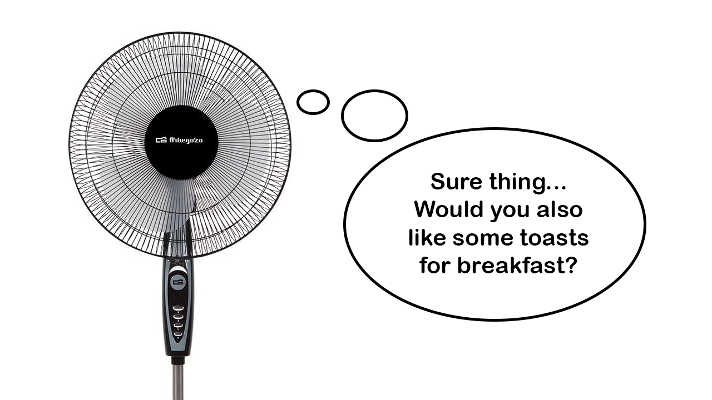

# NodeMCU Fan simple controller
### A small sketch that lets you control a generic 3-speed pedestal fan over MQTT using a NodeMCU board

## About this
Yes, I could have bought a smart fan, but where's the fun in there? 😁. I designed this small sketch that lets me control a cheap foot pedestal fan from any MQTT application, in my case, Home Assistant. With this, I could, for example, change between my air conditioner and my fan automatically, in the hours where electricity prices go through the roof, or automatically turn it off when activating the out-of-home scene.

The sketch uses [WiFiManager](https://github.com/tzapu/WiFiManager) to allow the WiFi configuration in case it changes without having to reprogram the board.

## Installation
You'll need:

### Hardware
- NodeMCU or similar microcontroller from the ESP8266 family. It will need 6 free GPIO.
- A way of assembling the microcontroller and the rest of the needed components (resistors, diode, transistors, relays...). In my case, I used [this schematic](EasyEDA_Schematics.zip)

### Software
- [Arduino IDE](https://www.arduino.cc/en/Main/Software)
- The [ESP8266WiFi](https://github.com/esp8266/Arduino/tree/master/libraries/ESP8266WiFi) library
- The [PubSubClient](https://github.com/knolleary/pubsubclient) library
- The [ESP8266 WiFiManager](https://github.com/tzapu/WiFiManager) library
- An MQTT server to communicate to (in my case I use [Mosquitto](https://mosquitto.org/)

### Configuration of the Arduino Sketch
You'll need to copy the "Configuration.h.example" file as "Configuration.h" and change the IP, user, and password of your MQTT server, the client ID, the two MQTT topics to use and an SSID and password to create a new WiFi connection with a captive portal, that lets you connect to your WiFi router. This is not your actual WiFi router SSID and password, but a new one. Once you power on the microcontroller for the first time, connect to the SSID you configured here with your password and navigate to the captive portal to then configure your real WiFi connection.

More info at https://elprogramadoriberico.es/en/2022/03/01/making-a-cheap-pedestal-fan-smarter/
